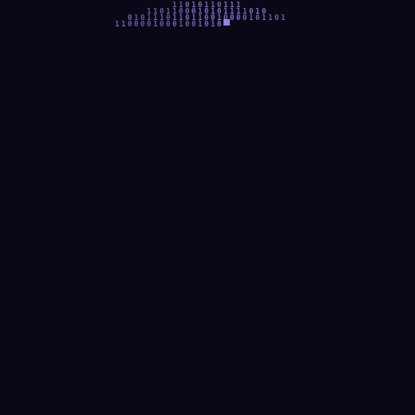

<<<<<<< HEAD
<!-- Wavy Banner -->
<p align="center">
  
</p>

<div align="center">

# Hi 👋, I'm ASHUTOSH SHARMA!

</div>

<div align="center">

Full-Stack Developer (MERN + TypeScript) | AI Agents Builder | B.Tech CSE @ Medi-Caps University

</div>

<div align="center">

B.Tech CSE student at Medi-Caps University (2024–2028), based in Indore, India. Currently building an autonomous "issue-to-PR" AI coding agent (React/Vite + FastAPI + SQLite) and exploring AI-generated cinematic video projects.

</div>
<div align="center">
  <a href="[FILL_IN_RESUME_DRIVE_LINK]" target="_blank">
    
  </a>
</div>

<p align="center">
  
</p>


## **💻 About Me**


- 🎓 B.Tech CSE student at **Medi-Caps University**, Indore, India (2024–2028)
- 🤖 Currently building an autonomous **"issue-to-PR" AI coding agent** (React/Vite + FastAPI + SQLite)
- 🎬 Exploring **AI-generated cinematic video projects**
- 💬 Ask me about: **DSA, System Design, MERN stack, LLM tooling/agents**
- 👨‍💻 My Portfolio is available at (<https://sh32ashutosh.netlify.app>)
- 📫 How to reach me <sh32ashutosh@gmail.com>
- 📄 My Resume is available here [RESUME]([FILL_IN_RESUME_DRIVE_LINK])
- 🏆 **Highlights:**
  - ⭐ 3★ CodeChef
  - 🥇 Top 1,500 globally in Google "The Big Code" 2026
  - 🇮🇳 Smart India Hackathon 2025 finalist
  - 💻 Tata CodeVita S12 Round 1 qualifier
- ⚡ **Fun fact →**

  > *"I push at midnight, heart pounding like a loop,*
  > *the CI turns green and I forget to eat soup.*
  > *Every bug I fix births two I haven't met —*
  > *but the diff is clean, and that's as good as it gets."*

<br>

<div align="center">
  <a href="https://open.spotify.com/user/31cpgfo6hu4ztq7lc45ke2qbr2ee">
    
  </a>
</div>


## **Socials**

<p align="left">
  <a href="mailto:sh32ashutosh@gmail.com" target="_blank"></a>
  <a href="https://sh32ashutosh.netlify.app" target="_blank"></a>
  <a href="https://github.com/sh32ashutosh" target="_blank"></a>
  <a href="https://linkedin.com/in/sh32ashutosh" target="_blank"></a>
  <a href="https://leetcode.com/u/pobedil/" target="_blank"></a>
  <a href="https://www.naukri.com/code360/profile/Ashutoshsharma" target="_blank"></a>
</p>


##  My Tech Arsenal


<div align=center>

#### Programming Languages

<table align="center">
  <tr>
    <td align="center" width="116">
        
      <br>C++
    </td>
    <td align="center" width="116">
        
      <br>Python
    </td>
    <td align="center" width="116">
        
      <br>JavaScript
    </td>
    <td align="center" width="116">
        
      <br>TypeScript
    </td>
  </tr>
</table>

#### Frontend Development

<table align="center">
  <tr>
    <td align="center" width="116">
        
      <br>React
    </td>
    <td align="center" width="116">
        
      <br>Next.js
    </td>
    <td align="center" width="116">
        
      <br>Redux
    </td>
    <td align="center" width="116">
        
      <br>Tailwind CSS
    </td>
  </tr>
</table>

#### Backend Development

<table align="center">
  <tr>
    <td align="center" width="116">
        
      <br>Node.js
    </td>
    <td align="center" width="116">
        
      <br>Express
    </td>
    <td align="center" width="116">
        
      <br>GraphQL
    </td>
    <td align="center" width="116">
        
      <br>Socket.IO
    </td>
  </tr>
</table>

#### Databases

<table align="center">
  <tr>
    <td align="center" width="116">
        
      <br>MongoDB
    </td>
    <td align="center" width="116">
        
      <br>PostgreSQL
    </td>
    <td align="center" width="116">
        
      <br>Redis
    </td>
  </tr>
</table>

#### DevOps & Tools

<table align="center">
  <tr>
    <td align="center" width="116">
        
      <br>Docker
    </td>
    <td align="center" width="116">
        
      <br>AWS
    </td>
    <td align="center" width="116">
        
      <br>Git
    </td>
    <td align="center" width="116">
        
      <br>GitHub
    </td>
    <td align="center" width="116">
        
      <br>Linux
    </td>
  </tr>
</table>

<div align="center">


## **Analytics & Statistics**


<div align="center">


</div>

## My Contribution Graph

<div align="center">
  
</div>


## Extra Insights (cards)

<div align="center">

<!-- Summary cards — consistent theme -->


=======
<div align="center">


<br/>

<!-- Portrait lives at assets/binary-portrait-typing.gif in this repo -->


<br/><br/>

[](https://sh32ashutosh.netlify.app/)
[](https://www.linkedin.com/in/sh32ashutosh/)
[](mailto:sh32ashutosh@gmail.com)
[](https://github.com/sh32ashutosh)


>>>>>>> 6b0900ba89e0b8141f3b87859d55d40849cf2358

</div>

---

<<<<<<< HEAD
## OSSInsight Dashboard

<div align="center">
  <a href="https://next.ossinsight.io/widgets/official/compose-user-dashboard-stats?user_id=[FILL_IN_OSSINSIGHT_USER_ID]" target="_blank" rel="noopener noreferrer">
    
  </a>
</div>


<div align="center">

### Hacktoberfest Badges 2025

[](https://holopin.io/@sh32ashutosh)


### LeetCode Progress

[](https://leetcode.com/u/pobedil/)

</div>


### ✍️ Dev Quote

<p align="center">
  <em>"Code is like humor. When you have to explain it, it's bad." — Cory House</em>
</p>


<em>Let's connect and build the future together! 🚀 <em>
<p align="center">
  Made with 💖 by a Passionate Programmer <b>Ashutosh Sharma</b>
</p>


###### sh32ashutosh___________________________________________________________________________________________________© 2026 Ashutosh Sharma – Crafted with 💖
=======
<table>
<tr>
<td width="50%" valign="top">

```yaml
$ neofetch --about-me

name:      Ashutosh Sharma
role:      Full Stack Software Developer
school:    Medi-Caps University
degree:    B.Tech, CSE (2024-2028)
location:  Indore, India
stack:     MERN + TypeScript
weapon:    VS Code + black coffee
bug_count: undefined (it's a feature)
```

</td>
<td width="50%" valign="top">

```diff
+ Ships full-stack apps that scale
+ Optimizes queries before breakfast
+ Reads RFCs for fun (don't judge)
- Doesn't believe in "it works on my machine"
! Currently arguing with a race condition
```

</td>
</tr>
</table>

---

## Highlights Reel

<div align="center">

| 3★ Coder | Semifinalist | Finalist | Qualified | Shipped |
|:---:|:---:|:---:|:---:|:---:|
| CodeChef | Google The Big Code 2026 (Top 1,500 globally) | Smart India Hackathon 2025 | Tata CodeVita S12 — R1 | 10+ full-stack apps |

</div>

<div align="center">

</div>

---

## The Arsenal

<div align="center">


</div>

<div align="center">

`WebRTC` • `JWT` • `RBAC` • `Microservices` • `CI/CD` • `Framer Motion` • `PWA` • `OOP` • `OS` • `DBMS`

</div>

---

## Featured Builds

<details open>
<summary><b>📡 Adaptive Low-Bandwidth Learning Platform</b> — real-time classroom, even on bad Wi-Fi</summary>
<br/>

`Next.js` `Node.js` `WebRTC` `Socket.IO` `MongoDB` `Redis` `TypeScript`

> Built so a classroom doesn't grind to a halt the moment someone's signal drops to one bar.

- Dynamically adapts media quality based on live latency, packet loss, and network conditions via WebRTC
- Multilingual messaging, breakout rooms, attendance tracking, and session scheduling
- Redis caching + event-driven architecture cut API response times significantly
- Secure auth system with RBAC and role-scoped permissions

</details>

<details>
<summary><b>🤖 Distributed AI-Powered Code Review Platform</b> — your PRs, reviewed by an AI senior engineer</summary>
<br/>

`Next.js` `Node.js` `OpenAI API` `PostgreSQL` `Redis` `Docker` `WebSocket`

> SaaS platform that reviews your pull requests like a senior engineer — minus the passive-aggressive comments.

- LLM-powered pipelines detect security vulnerabilities, code smells, and maintainability gaps
- Real-time notifications and collaboration via WebSockets + async event processing
- Redis job queues, background workers, and PostgreSQL schemas handle concurrent workloads
- Containerized with Docker, deployed via automated CI/CD pipelines

</details>

<details>
<summary><b>🎓 Club Attendance Management System</b> — spreadsheets, retired</summary>
<br/>

`React.js` `Node.js` `Express.js` `MongoDB` `JWT` `OCR`

> Centralized platform for university clubs, because nobody should manually count heads in 2026.

- OCR-based automated attendance verification — zero manual data entry
- Analytics dashboards with participation insights, export tools, and reporting
- JWT auth, RBAC, and secure API architecture with optimized MongoDB indexing

</details>

---

## By the Numbers

<div align="center">


</div>

---

## The Snake That Eats My Commits

<div align="center">


</div>

> 

---

<details>
<summary>🥚 Found a secret. Click to see it.</summary>
<br/>

You scrolled this far. Respect. Here's the actual source of most of my bugs:

```js
function deploy() {
  // TODO: fix this before it breaks in prod
  return "it'll probably be fine";
}
```

</details>

---

<div align="center">

*"First, solve the problem. Then, write the code."*
**— John Johnson**

<br/>

**Open to internships, collabs, and interesting problems.**
**Let's build something →** [sh32ashutosh@gmail.com](mailto:sh32ashutosh@gmail.com)


</div>
>>>>>>> 6b0900ba89e0b8141f3b87859d55d40849cf2358
